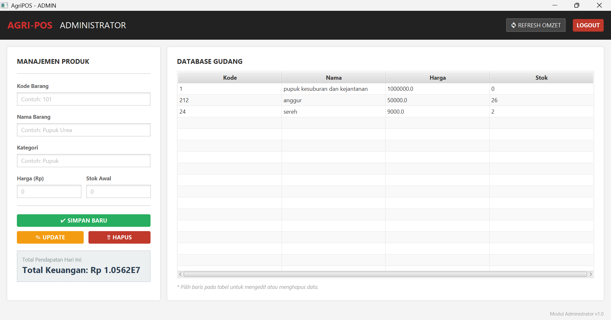
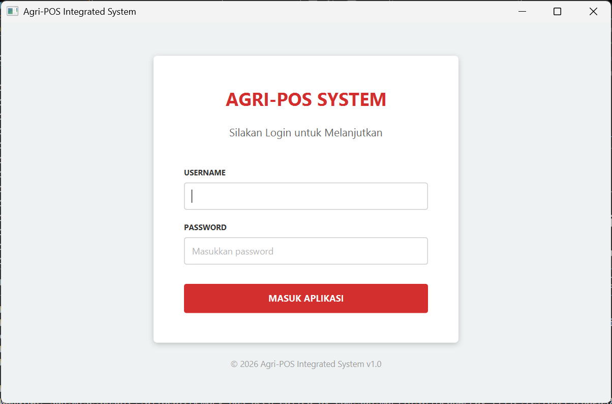
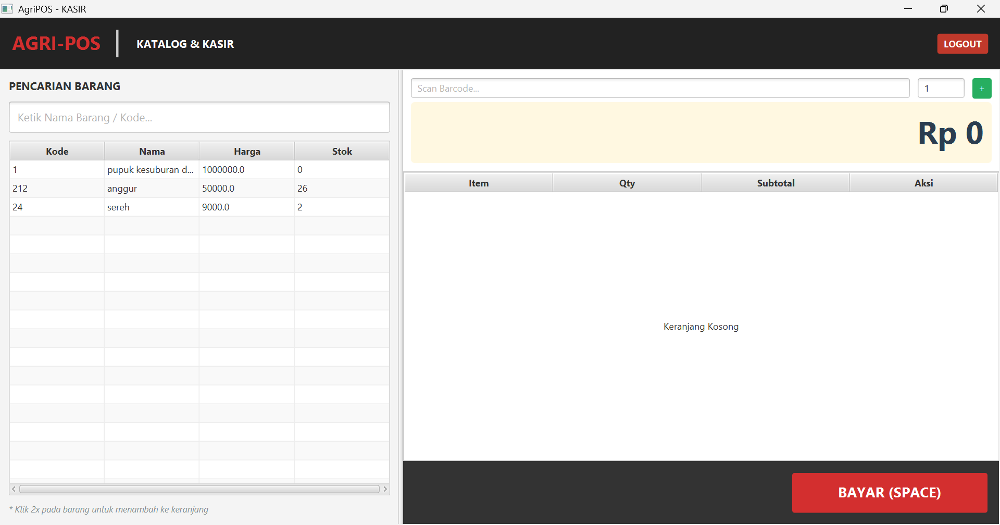

# Laporan Praktikum Minggu 15
Topik: Final Project - Agri-POS Integrated System (Integrasi Database & UI Modern )

## Identitas
- kelompok 1
- anggota:

   - Bagus Alldiansyah (240202830)
   - chesa salsabil al'ma'ruf (24020831)
kelas : 3ikra
---

## Tujuan
1. Mahasiswa mampu membangun aplikasi Point of Sales (POS) yang terintegrasi penuh dengan database PostgreSQL.

2. Mahasiswa memahami implementasi arsitektur MVC (Model-View-Controller) dan Repository Pattern dalam proyek skala menengah.

3. Mahasiswa dapat membuat antarmuka pengguna (UI) yang modern dan user-friendly menggunakan JavaFX dan FXML.

4. Mahasiswa mampu melakukan debugging pada koneksi database dan logika bisnis (transaksi & stok).
---


## Dasar Teori
1. MVC Architecture: Pola desain yang memisahkan aplikasi menjadi tiga komponen utama: Model (Data), View (Tampilan Antarmuka), dan Controller (Logika Bisnis). Hal ini memudahkan pemeliharaan kode.

2. Repository Pattern: Sebuah lapisan abstraksi antara logika aplikasi dan lapisan akses data (database). Pattern ini memastikan bahwa kode Java tidak tercampur aduk dengan query SQL yang kompleks.

4. JavaFX & FXML: Framework untuk membangun aplikasi desktop di Java. FXML digunakan untuk mendesain layout secara deklaratif (mirip HTML), yang kemudian dikontrol oleh kelas Controller Java.

5. PostgreSQL & JDBC: PostgreSQL adalah sistem manajemen database relasional (RDBMS) yang digunakan untuk menyimpan data user, produk, dan transaksi secara persisten. JDBC (Java Database Connectivity) adalah API yang menghubungkan aplikasi Java dengan database tersebut.

---

## Langkah Praktikum
1. Persiapan Database: Membuat skema database agripos_db di PostgreSQL yang terdiri dari tabel users (untuk login), products (stok barang), dan transactions (laporan keuangan).

2. Konfigurasi Koneksi: Mengatur file DatabaseConnection.java agar terhubung ke database lokal menggunakan driver JDBC PostgreSQL.

3 Implementasi Backend (Logika):

   - Membuat AuthService untuk memvalidasi login admin dan kasir.

   - Membuat JdbcProductRepository untuk menangani CRUD barang dan pemotongan stok otomatis.

   - Membuat TransactionRepository untuk menyimpan riwayat transaksi.

   - Implementasi Frontend (Tampilan):

   - Mendesain login.fxml, admin.fxml, dan pos.fxml.

   - Memperbarui tampilan POS menjadi tema modern (gaya BEEPOS) dengan header hitam dan aksen merah.


---

## Kode Program


### struktur direktory
```
STRUKTUR FOLDER
demo/
├── pom.xml                          (Konfigurasi Maven & Dependencies)
├── src/
│   └── main/
│       ├── java/
│       │   └── com/
│       │       └── upb/
│       │           └── agripos/
│       │               │
│       │               ├── AppJavaFX.java         (Main Class - Pintu Masuk Aplikasi)
│       │               │
│       │               ├── auth/                  (Modul Keamanan)
│       │               │   ├── AuthService.java   (Cek Login ke DB)
│       │               │   └── User.java          (Model Data User)
│       │               │
│       │               ├── controller/            (Pengendali UI)
│       │               │   ├── AdminController.java
│       │               │   ├── LoginController.java
│       │               │   └── PosController.java
│       │               │
│       │               ├── product/               (Logika Barang)
│       │               │   ├── Product.java       (Model Data Produk)
│       │               │   ├── ProductRepository.java (Interface)
│       │               │   ├── JdbcProductRepository.java (Eksekutor SQL)
│       │               │   └── ProductService.java (Penghubung Controller-Repo)
│       │               │
│       │               ├── transaction/           (Logika Keranjang & Penjualan)
│       │               │   ├── Cart.java
│       │               │   ├── CartItem.java
│       │               │   └── TransactionRepository.java (Simpan Laporan)
│       │               │
│       │               ├── payment/               (Pola Factory Pembayaran - Opsional)
│       │               │   ├── PaymentMethod.java
│       │               │   ├── PaymentFactory.java
│       │               │   └── CashPayment.java
│       │               │
│       │               ├── report/                (Laporan Keuangan)
│       │               │   └── ReportService.java
│       │               │
│       │               └── util/                  (Koneksi Database)
│       │                   └── DatabaseConnection.java
│       │
│       └── resources/
│           └── fxml/                (Desain Tampilan Antarmuka)
│               ├── admin.fxml       (Dashboard Admin)
│               ├── login.fxml       (Halaman Login)
│               └── pos.fxml         (Terminal Kasir Modern)
```
### POM.XML
```xml
<?xml version="1.0" encoding="UTF-8"?>
<project xmlns="http://maven.apache.org/POM/4.0.0"
         xmlns:xsi="http://www.w3.org/2001/XMLSchema-instance"
         xsi:schemaLocation="http://maven.apache.org/POM/4.0.0 http://maven.apache.org/xsd/maven-4.0.0.xsd">
    <modelVersion>4.0.0</modelVersion>

    <groupId>com.upb</groupId>
    <artifactId>agripos</artifactId>
    <version>1.0-SNAPSHOT</version>

    <properties>
        <project.build.sourceEncoding>UTF-8</project.build.sourceEncoding>
        <maven.compiler.source>17</maven.compiler.source>
        <maven.compiler.target>17</maven.compiler.target>
        <javafx.version>17.0.6</javafx.version>
    </properties>

    <dependencies>
        <dependency>
            <groupId>org.openjfx</groupId>
            <artifactId>javafx-controls</artifactId>
            <version>${javafx.version}</version>
        </dependency>

        <dependency>
            <groupId>org.openjfx</groupId>
            <artifactId>javafx-fxml</artifactId>
            <version>${javafx.version}</version>
        </dependency>

        <dependency>
            <groupId>org.postgresql</groupId>
            <artifactId>postgresql</artifactId>
            <version>42.6.0</version>
        </dependency>

        <dependency>
            <groupId>junit</groupId>
            <artifactId>junit</artifactId>
            <version>4.13.2</version>
            <scope>test</scope>
        </dependency>
    </dependencies>

    <build>
        <plugins>
            <plugin>
                <groupId>org.apache.maven.plugins</groupId>
                <artifactId>maven-compiler-plugin</artifactId>
                <version>3.8.1</version>
                <configuration>
                    <source>17</source>
                    <target>17</target>
                </configuration>
            </plugin>

            <plugin>
                <groupId>org.openjfx</groupId>
                <artifactId>javafx-maven-plugin</artifactId>
                <version>0.0.8</version>
                <configuration>
                    <mainClass>com.upb.agripos.AppJavaFX</mainClass>
                </configuration>
            </plugin>
        </plugins>
    </build>
</project>
```
### MAIN PROGRAM

AppJavaFX.java
```java
package com.upb.agripos;

import javafx.application.Application;
import javafx.fxml.FXMLLoader;
import javafx.scene.Scene;
import javafx.stage.Stage;

public class AppJavaFX extends Application {
    @Override
    public void start(Stage stage) throws Exception {
        FXMLLoader loader = new FXMLLoader(getClass().getResource("/fxml/login.fxml"));
        stage.setScene(new Scene(loader.load()));
        stage.setTitle("Agri-POS Integrated System");
        stage.show();
    }
    public static void main(String[] args) { launch(args); }
}
```
### FUNGSI LOGIN

AuthService.java
```java
package com.upb.agripos.auth;

import java.sql.Connection;
import java.sql.PreparedStatement;
import java.sql.ResultSet;
import java.sql.SQLException;

import com.upb.agripos.util.DatabaseConnection;

public class AuthService {
    public User login(String username, String password) {
        System.out.println("--- MEMULAI PROSES LOGIN ---");
        System.out.println("Mencoba login dengan User: " + username);
        
        String sql = "SELECT role FROM users WHERE username = ? AND password = ?";
        
        try (Connection conn = DatabaseConnection.getConnection()) {
            if (conn == null) {
                System.out.println("[ERROR] KONEKSI NULL! Cek DatabaseConnection.java");
                return null;
            }
            System.out.println("[INFO] Koneksi Database Berhasil Terbuka");

            try (PreparedStatement ps = conn.prepareStatement(sql)) {
                ps.setString(1, username);
                ps.setString(2, password);
                
                try (ResultSet rs = ps.executeQuery()) {
                    if (rs.next()) {
                        String role = rs.getString("role");
                        System.out.println("[SUKSES] User Ditemukan! Role: " + role);
                        return new User(username, role);
                    } else {
                        System.out.println("[GAGAL] User tidak ditemukan atau Password salah.");
                    }
                }
            }
        } catch (SQLException e) {
            System.out.println("[CRITICAL ERROR] Terjadi kesalahan database:");
            e.printStackTrace(); // Ini akan mencetak error merah di terminal
        }
        return null;
    }
}
```
User.java
```java
package com.upb.agripos.auth;

public class User {
    private String username;
    private String role; // ADMIN atau KASIR

    public User(String username, String role) {
        this.username = username;
        this.role = role;
    }

    public String getUsername() { return username; }
    public String getRole() { return role; }
}
```

### PROGRAM KONTROL

AdminController.java
```java
package com.upb.agripos.controller;

import java.io.IOException;

import com.upb.agripos.product.JdbcProductRepository;
import com.upb.agripos.product.Product;
import com.upb.agripos.product.ProductService;
import com.upb.agripos.report.ReportService;

import javafx.collections.FXCollections;
import javafx.fxml.FXML;
import javafx.fxml.FXMLLoader;
import javafx.scene.Parent;
import javafx.scene.Scene;
import javafx.scene.control.Label;
import javafx.scene.control.TableColumn;
import javafx.scene.control.TableView;
import javafx.scene.control.TextField;
import javafx.scene.control.cell.PropertyValueFactory;
import javafx.stage.Stage;

public class AdminController {
    @FXML private TextField txtKode, txtNama, txtKategori, txtHarga, txtStok;
    @FXML private TableView<Product> tblRak;
    @FXML private Label lblOmzet;

    private ProductService service = new ProductService(new JdbcProductRepository());
    private ReportService report = new ReportService();

    @FXML
    public void initialize() {
        // Inisialisasi kolom tabel agar tidak muncul pesan "No columns in table"
        TableColumn<Product, String> colKode = new TableColumn<>("Kode");
        colKode.setCellValueFactory(new PropertyValueFactory<>("kode"));
        
        TableColumn<Product, String> colNama = new TableColumn<>("Nama");
        colNama.setCellValueFactory(new PropertyValueFactory<>("nama"));
        
        TableColumn<Product, Double> colHarga = new TableColumn<>("Harga");
        colHarga.setCellValueFactory(new PropertyValueFactory<>("harga"));
        
        TableColumn<Product, Integer> colStok = new TableColumn<>("Stok");
        colStok.setCellValueFactory(new PropertyValueFactory<>("stok"));

        tblRak.getColumns().setAll(colKode, colNama, colHarga, colStok);
        refresh();
    }

    @FXML public void handleSave() {
        service.add(new Product(txtKode.getText(), txtNama.getText(), txtKategori.getText(), 
                    Double.parseDouble(txtHarga.getText()), Integer.parseInt(txtStok.getText())));
        refresh();
    }

    @FXML public void handleUpdate() {
        service.update(new Product(txtKode.getText(), txtNama.getText(), txtKategori.getText(), 
                       Double.parseDouble(txtHarga.getText()), Integer.parseInt(txtStok.getText())));
        refresh();
    }

    @FXML public void handleDelete() {
        service.delete(txtKode.getText());
        refresh();
    }

    @FXML public void handleReport() {
        lblOmzet.setText("Total Keuangan: Rp " + report.getDailyTurnover());
    }

    private void refresh() {
        tblRak.setItems(FXCollections.observableArrayList(service.list()));
    }
    @FXML
    public void handleLogout() {
        try {
            // 1. Load file Login
            FXMLLoader loader = new FXMLLoader(getClass().getResource("/fxml/login.fxml"));
            Parent root = loader.load();

            // 2. Ambil Stage (Jendela) saat ini dari salah satu komponen (misal: txtKode)
            Stage stage = (Stage) txtKode.getScene().getWindow();
            
            // 3. Ganti Scene ke Login
            stage.setScene(new Scene(root));
            stage.setTitle("Agri-POS Integrated System");
            stage.centerOnScreen();
            System.out.println("[INFO] Admin berhasil Logout.");
            
        } catch (IOException e) {
            e.printStackTrace();
        }
    }
}
```
LoginController.java
```java
package com.upb.agripos.controller;

import com.upb.agripos.auth.AuthService;
import com.upb.agripos.auth.User;

import javafx.fxml.FXML;
import javafx.fxml.FXMLLoader;
import javafx.scene.Parent;
import javafx.scene.Scene;
import javafx.scene.control.Alert;
import javafx.scene.control.PasswordField;
import javafx.scene.control.TextField;
import javafx.stage.Stage;

public class LoginController {
    @FXML private TextField txtUsername;
    @FXML private PasswordField txtPassword;
    private AuthService authService = new AuthService();

    @FXML
    public void handleLogin() {
        User user = authService.login(txtUsername.getText(), txtPassword.getText());

        if (user != null) {
            String fxml = user.getRole().equalsIgnoreCase("ADMIN") ? "/fxml/admin.fxml" : "/fxml/pos.fxml";
            loadScene(fxml, "AgriPOS - " + user.getRole(), user);
        } else {
            new Alert(Alert.AlertType.ERROR, "Login Gagal!").show();
        }
    }

    private void loadScene(String fxml, String title, User user) {
        try {
            FXMLLoader loader = new FXMLLoader(getClass().getResource(fxml));
            Parent root = loader.load();
            
            // Jika masuk ke POS, kirim data user agar struk tahu nama kasirnya
            if (fxml.equals("/fxml/pos.fxml")) {
                PosController pc = loader.getController();
                pc.setUser(user);
            }

            Stage stage = (Stage) txtUsername.getScene().getWindow();
            stage.setScene(new Scene(root));
            stage.setTitle(title);
            stage.show();
        } catch (Exception e) { e.printStackTrace(); }
    }
}
```
PosControler.java
```java
package com.upb.agripos.controller;

import com.upb.agripos.auth.User;
import com.upb.agripos.product.*;
import com.upb.agripos.transaction.*;
import javafx.fxml.FXML;
import javafx.fxml.FXMLLoader;
import javafx.scene.Scene;
import javafx.scene.control.*;
import javafx.scene.control.cell.PropertyValueFactory;
import javafx.scene.layout.HBox;
import javafx.collections.FXCollections;
import javafx.collections.ObservableList;
import javafx.collections.transformation.FilteredList;
import javafx.stage.Stage;
import javafx.util.Callback;
import javafx.geometry.Pos;

import java.io.IOException;
import java.util.Optional;
import java.util.UUID;

public class PosController {
    @FXML private TextField txtCari;
    @FXML private TableView<Product> tblKatalog;
    @FXML private TextField txtKode, txtQty;
    @FXML private TableView<CartItem> tblCart; // Pastikan fx:id di FXML adalah tblCart
    @FXML private Label lblTotal;
    
    private ProductService prodService = new ProductService(new JdbcProductRepository());
    private TransactionRepository transRepo = new TransactionRepository();
    private Cart cart = new Cart();
    private User currentUser;
    private ObservableList<Product> masterData = FXCollections.observableArrayList();

    public void setUser(User user) { this.currentUser = user; }

    @FXML
    public void initialize() {
        setupKatalog();
        setupKeranjang();
    }

    private void setupKatalog() {
        // Reset kolom dulu biar tidak duplikat
        tblKatalog.getColumns().clear();

        TableColumn<Product, String> colKode = new TableColumn<>("Kode");
        colKode.setCellValueFactory(new PropertyValueFactory<>("kode"));
        
        TableColumn<Product, String> colNama = new TableColumn<>("Nama");
        colNama.setCellValueFactory(new PropertyValueFactory<>("nama"));
        
        TableColumn<Product, Double> colHarga = new TableColumn<>("Harga");
        colHarga.setCellValueFactory(new PropertyValueFactory<>("harga"));
        
        TableColumn<Product, Integer> colStok = new TableColumn<>("Stok");
        colStok.setCellValueFactory(new PropertyValueFactory<>("stok"));

        tblKatalog.getColumns().addAll(colKode, colNama, colHarga, colStok);
        
        // Load Data
        masterData.setAll(prodService.list());

        // Filter Pencarian
        FilteredList<Product> filteredData = new FilteredList<>(masterData, p -> true);
        txtCari.textProperty().addListener((obs, oldVal, newVal) -> {
            filteredData.setPredicate(p -> {
                if (newVal == null || newVal.isEmpty()) return true;
                String lower = newVal.toLowerCase();
                return p.getNama().toLowerCase().contains(lower) || p.getKode().toLowerCase().contains(lower);
            });
        });
        tblKatalog.setItems(filteredData);
        
        // Klik 2x masuk keranjang
        tblKatalog.setOnMouseClicked(e -> {
            if (e.getClickCount() == 2 && tblKatalog.getSelectionModel().getSelectedItem() != null) {
                addToCartLogic(tblKatalog.getSelectionModel().getSelectedItem(), 1);
            }
        });
    }

    private void setupKeranjang() {
        tblCart.getColumns().clear(); // Hapus kolom bawaan FXML jika ada

        TableColumn<CartItem, String> colItem = new TableColumn<>("Item");
        colItem.setCellValueFactory(cell -> new javafx.beans.property.SimpleStringProperty(cell.getValue().getProduct().getNama()));
        colItem.setPrefWidth(120);
        
        TableColumn<CartItem, Integer> colQty = new TableColumn<>("Qty");
        colQty.setCellValueFactory(new PropertyValueFactory<>("quantity"));
        colQty.setStyle("-fx-alignment: CENTER;");
        
        TableColumn<CartItem, Double> colSub = new TableColumn<>("Subtotal");
        colSub.setCellValueFactory(new PropertyValueFactory<>("subtotal"));

        // KOLOM AKSI (Tombol +, -, Hapus)
        TableColumn<CartItem, Void> colAction = new TableColumn<>("Aksi");
        colAction.setPrefWidth(140);
        
        Callback<TableColumn<CartItem, Void>, TableCell<CartItem, Void>> cellFactory = new Callback<>() {
            @Override
            public TableCell<CartItem, Void> call(final TableColumn<CartItem, Void> param) {
                return new TableCell<>() {
                    private final Button btnMinus = new Button("-");
                    private final Button btnPlus = new Button("+");
                    private final Button btnDel = new Button("X");

                    {
                        // Styling Tombol
                        btnMinus.setStyle("-fx-background-color: #f39c12; -fx-text-fill: white; -fx-min-width: 30px;");
                        btnPlus.setStyle("-fx-background-color: #27ae60; -fx-text-fill: white; -fx-min-width: 30px;");
                        btnDel.setStyle("-fx-background-color: #c0392b; -fx-text-fill: white; -fx-min-width: 30px;");

                        // Logika Tombol (-)
                        btnMinus.setOnAction(event -> {
                            CartItem item = getTableView().getItems().get(getIndex());
                            if (item.getQuantity() > 1) {
                                cart.updateQty(item.getProduct().getKode(), item.getQuantity() - 1);
                            } else {
                                cart.removeItem(item.getProduct().getKode());
                            }
                            refreshCartUI();
                        });

                        // Logika Tombol (+)
                        btnPlus.setOnAction(event -> {
                            CartItem item = getTableView().getItems().get(getIndex());
                            // Cek stok database/gudang dulu
                            if (item.getProduct().getStok() > item.getQuantity()) {
                                cart.updateQty(item.getProduct().getKode(), item.getQuantity() + 1);
                                refreshCartUI();
                            } else {
                                new Alert(Alert.AlertType.WARNING, "Stok Gudang Habis!").show();
                            }
                        });

                        // Logika Tombol (X)
                        btnDel.setOnAction(event -> {
                            CartItem item = getTableView().getItems().get(getIndex());
                            cart.removeItem(item.getProduct().getKode());
                            refreshCartUI();
                        });
                    }

                    @Override
                    public void updateItem(Void item, boolean empty) {
                        super.updateItem(item, empty);
                        if (empty) {
                            setGraphic(null);
                        } else {
                            HBox pane = new HBox(5, btnMinus, btnPlus, btnDel);
                            pane.setAlignment(Pos.CENTER);
                            setGraphic(pane);
                        }
                    }
                };
            }
        };

        colAction.setCellFactory(cellFactory);
        tblCart.getColumns().addAll(colItem, colQty, colSub, colAction);
    }

    // Refresh Tampilan Tabel & Total Harga
    private void refreshCartUI() {
        tblCart.setItems(FXCollections.observableArrayList(cart.getItems()));
        lblTotal.setText("Rp " + String.format("%.0f", cart.getTotal()));
        tblCart.refresh(); 
    }

    @FXML
    public void handleAdd() {
        String kode = txtKode.getText();
        if (kode.isEmpty()) return;
        Product p = prodService.get(kode);
        int qty = 1;
        try { qty = Integer.parseInt(txtQty.getText()); } catch (Exception e) {}
        
        addToCartLogic(p, qty);
    }

    private void addToCartLogic(Product p, int qty) {
        if (p != null) {
            if (p.getStok() >= qty) {
                cart.addItem(p, qty);
                refreshCartUI();
                txtKode.clear();
                txtQty.setText("1");
            } else {
                new Alert(Alert.AlertType.WARNING, "Stok Tidak Cukup!").show();
            }
        } else {
            new Alert(Alert.AlertType.WARNING, "Barang Tidak Ditemukan!").show();
        }
    }

    @FXML
    public void handleCheckout() {
        if (cart.getItems().isEmpty()) return;
        double total = cart.getTotal();

        TextInputDialog dialog = new TextInputDialog();
        dialog.setTitle("Pembayaran");
        dialog.setHeaderText("Total: Rp " + String.format("%.0f", total));
        dialog.setContentText("Masukkan Nominal Uang:");

        Optional<String> result = dialog.showAndWait();
        result.ifPresent(uang -> {
            try {
                double bayar = Double.parseDouble(uang);
                if (bayar >= total) {
                    processTransaction(total, bayar, bayar - total);
                } else {
                    new Alert(Alert.AlertType.ERROR, "Uang Kurang!").show();
                }
            } catch (Exception e) {
                new Alert(Alert.AlertType.ERROR, "Input Salah!").show();
            }
        });
    }

    private void processTransaction(double total, double bayar, double kembali) {
        String id = "TRX-" + UUID.randomUUID().toString().substring(0,5).toUpperCase();
        transRepo.save(id, total, currentUser != null ? currentUser.getUsername() : "Kasir");
        
        for (CartItem item : cart.getItems()) {
            prodService.reduceStock(item.getProduct().getKode(), item.getQuantity());
        }
        
        cart.clear();
        refreshCartUI();
        masterData.setAll(prodService.list()); // Refresh stok katalog
        
        Alert info = new Alert(Alert.AlertType.INFORMATION);
        info.setTitle("Sukses");
        info.setHeaderText("Kembalian: Rp " + String.format("%.0f", kembali));
        info.setContentText("Transaksi Berhasil Disimpan.");
        info.show();
    }

    @FXML
    public void handleLogout() {
        try {
            Stage stage = (Stage) lblTotal.getScene().getWindow();
            stage.setScene(new Scene(FXMLLoader.load(getClass().getResource("/fxml/login.fxml"))));
            stage.centerOnScreen();
        } catch (IOException e) { e.printStackTrace(); }
    }
}
```
### PAYMENT METHIOD

CashPyment.java
```java
package com.upb.agripos.payment;

public class CashPayment implements PaymentMethod {
    @Override
    public boolean pay(double amount) {
        System.out.println("Memproses pembayaran tunai sebesar: " + amount);
        return true; // Tunai selalu dianggap berhasil di sisi sistem
    }
}
```
EWalletPayment.java

```java
package com.upb.agripos.payment;

public class EWalletPayment implements PaymentMethod {
    private PaymentGateway gateway;

    public EWalletPayment() {
        this.gateway = new PaymentGateway();
    }

    @Override
    public boolean pay(double amount) {
        System.out.println("Menghubungi Gateway untuk E-Wallet...");
        return gateway.verify(amount); // Verifikasi saldo sesuai Sequence Diagram
    }
}
```
PaymentFactory.java

```java
package com.upb.agripos.payment;

public class PaymentFactory {
    public static PaymentMethod getPaymentMethod(String type) {
        if (type.equalsIgnoreCase("CASH")) return (amount) -> {
            System.out.println("Bayar Tunai: " + amount);
            return true; 
        };
        return null;
    }
}
```
PaymentGateway.java
```java
package com.upb.agripos.payment;

public class PaymentGateway {
    public boolean verify(double amount) {
        // Simulasi: Anggap saja saldo selalu cukup untuk demo ini
        // Sesuai alur 'Verifikasi Saldo' di Activity Diagram
        return amount < 10000000; 
    }
}
```
PaymentMethod.java
```java
package com.upb.agripos.payment;
public interface PaymentMethod {
    boolean pay(double amount);
}
```
PaymentService.java
```java
package com.upb.agripos.payment;

public class PaymentService {
    /**
     * Memproses pembayaran sesuai dengan alur di Sequence Diagram
     */
    public boolean processPayment(double total, String type) {
        // 1. Dapatkan metode pembayaran dari Factory
        PaymentMethod method = PaymentFactory.getPaymentMethod(type);
        
        if (method == null) {
            System.err.println("Metode pembayaran tidak valid");
            return false;
        }
        
        // 2. Eksekusi pembayaran (Polymorphism)
        return method.pay(total);
    }
}
```
```java
package com.upb.agripos.product;

import java.sql.Connection;
import java.sql.PreparedStatement;
import java.sql.ResultSet;
import java.sql.SQLException;
import java.sql.Statement;
import java.util.ArrayList;
import java.util.List;

import com.upb.agripos.util.DatabaseConnection;

public class JdbcProductRepository implements ProductRepository {

    @Override
    public void addProduct(Product p) {
        String sql = "INSERT INTO products (kode, nama, kategori, harga, stok) VALUES (?, ?, ?, ?, ?)";
        executeSql(sql, p.getKode(), p.getNama(), p.getKategori(), p.getHarga(), p.getStok());
    }

    @Override
    public void updateProduct(Product p) {
        String sql = "UPDATE products SET nama=?, kategori=?, harga=?, stok=? WHERE kode=?";
        executeSql(sql, p.getNama(), p.getKategori(), p.getHarga(), p.getStok(), p.getKode());
    }

    @Override
    public void deleteProduct(String kode) {
        String sql = "DELETE FROM products WHERE kode = ?";
        executeSql(sql, kode);
    }

    @Override
    public void reduceStock(String kode, int qty) {
        // Logika untuk memotong stok saat kasir melakukan checkout
        String sql = "UPDATE products SET stok = stok - ? WHERE kode = ? AND stok >= ?";
        executeSql(sql, qty, kode, qty);
    }

    @Override
    public List<Product> listProducts() {
        List<Product> list = new ArrayList<>();
        // Mengambil data untuk mengisi tabel agar tidak kosong
        try (Connection conn = DatabaseConnection.getConnection();
             Statement st = conn.createStatement();
             ResultSet rs = st.executeQuery("SELECT * FROM products ORDER BY kode ASC")) {
            while (rs.next()) {
                list.add(new Product(rs.getString("kode"), rs.getString("nama"), 
                         rs.getString("kategori"), rs.getDouble("harga"), rs.getInt("stok")));
            }
        } catch (SQLException e) { e.printStackTrace(); }
        return list;
    }

    @Override
    public Product getProductByCode(String kode) {
        String sql = "SELECT * FROM products WHERE kode = ?";
        try (Connection conn = DatabaseConnection.getConnection();
             PreparedStatement ps = conn.prepareStatement(sql)) {
            ps.setString(1, kode);
            ResultSet rs = ps.executeQuery();
            if (rs.next()) {
                return new Product(rs.getString("kode"), rs.getString("nama"), 
                       rs.getString("kategori"), rs.getDouble("harga"), rs.getInt("stok"));
            }
        } catch (SQLException e) { e.printStackTrace(); }
        return null;
    }

    private void executeSql(String sql, Object... params) {
        try (Connection conn = DatabaseConnection.getConnection();
             PreparedStatement ps = conn.prepareStatement(sql)) {
            for (int i = 0; i < params.length; i++) { ps.setObject(i + 1, params[i]); }
            ps.executeUpdate();
        } catch (SQLException e) { e.printStackTrace(); }
    }
}
```
### class produk

Product.java
```java
package com.upb.agripos.product;

public class Product {
    private String kode;
    private String nama;
    private String kategori;
    private double harga;
    private int stok;

    public Product(String kode, String nama, String kategori, double harga, int stok) {
        this.kode = kode;
        this.nama = nama;
        this.kategori = kategori;
        this.harga = harga;
        this.stok = stok;
    }

    // Getter dan Setter
    public String getKode() { return kode; }
    public String getNama() { return nama; }
    public String getKategori() { return kategori; }
    public double getHarga() { return harga; }
    public int getStok() { return stok; }
    
    public void setStok(int stok) { this.stok = stok; }
}
```
ReportService.java
```java
package com.upb.agripos.report;
import java.sql.Connection;
import java.sql.ResultSet;
import java.sql.SQLException;
import java.sql.Statement;

import com.upb.agripos.util.DatabaseConnection;

public class ReportService {
    public double getDailyTurnover() {
        String sql = "SELECT SUM(total_amount) FROM transactions";
        try (Connection conn = DatabaseConnection.getConnection();
             Statement st = conn.createStatement();
             ResultSet rs = st.executeQuery(sql)) {
            if (rs.next()) return rs.getDouble(1);
        } catch (SQLException e) { e.printStackTrace(); }
        return 0;
    }
}
```
Cart.java
```java
package com.upb.agripos.transaction;

import java.util.ArrayList;
import java.util.List;

import com.upb.agripos.product.Product;

public class Cart {
    private List<CartItem> items = new ArrayList<>();

    public void addItem(Product product, int qty) {
        // Cek jika barang sudah ada, tinggal update qty
        for (CartItem item : items) {
            if (item.getProduct().getKode().equals(product.getKode())) {
                item.setQuantity(item.getQuantity() + qty);
                return;
            }
        }
        items.add(new CartItem(product, qty));
    }

    // --- FITUR BARU: Update Jumlah Langsung ---
    public void updateQty(String kode, int newQty) {
        for (CartItem item : items) {
            if (item.getProduct().getKode().equals(kode)) {
                if (newQty > 0) {
                    item.setQuantity(newQty);
                }
                return;
            }
        }
    }

    // --- FITUR BARU: Hapus Satu Item ---
    public void removeItem(String kode) {
        items.removeIf(item -> item.getProduct().getKode().equals(kode));
    }

    public void clear() { items.clear(); }

    public List<CartItem> getItems() { return items; }

    public double getTotal() {
        return items.stream().mapToDouble(CartItem::getSubtotal).sum();
    }
}
```
```java
package com.upb.agripos.transaction;

import com.upb.agripos.product.Product;

public class CartItem {
    private Product product;
    private int quantity;
    private double subtotal;

    public CartItem(Product product, int quantity) {
        this.product = product;
        this.quantity = quantity;
        this.subtotal = product.getHarga() * quantity;
    }

    public Product getProduct() { return product; }

    public int getQuantity() { return quantity; }

    // PERBAIKAN: Saat setQuantity, Subtotal WAJIB dihitung ulang!
    public void setQuantity(int quantity) {
        this.quantity = quantity;
        this.subtotal = this.product.getHarga() * quantity; // Ini kuncinya
    }

    public double getSubtotal() { return subtotal; }
}
```

```java
package com.upb.agripos.transaction;

import java.time.LocalDateTime;
import java.util.List;

public class Transaction {
    private String id;
    private List<CartItem> items;
    private double total;
    private LocalDateTime tanggal;

    public Transaction(String id, List<CartItem> items, double total) {
        this.id = id;
        this.items = items;
        this.total = total;
        this.tanggal = LocalDateTime.now();
    }

    // Getter
    public String getId() { return id; }
    public List<CartItem> getItems() { return items; }
    public double getTotal() { return total; }
    public LocalDateTime getTanggal() { return tanggal; }
}
```
```java
package com.upb.agripos.transaction;

import java.sql.Connection;
import java.sql.PreparedStatement;
import java.sql.SQLException;

import com.upb.agripos.util.DatabaseConnection;

public class TransactionRepository {
    public void save(String id, double total, String cashier) {
        String sql = "INSERT INTO transactions (id, total_amount, cashier_username) VALUES (?, ?, ?)";
        try (Connection conn = DatabaseConnection.getConnection();
             PreparedStatement ps = conn.prepareStatement(sql)) {
            ps.setString(1, id);
            ps.setDouble(2, total);
            ps.setString(3, cashier);
            ps.executeUpdate();
        } catch (SQLException e) { e.printStackTrace(); }
    }
}
```

### koneksi database

```java
package com.upb.agripos.util;

import java.sql.Connection;
import java.sql.DriverManager;
import java.sql.SQLException;

public class DatabaseConnection {
    // Pastikan nama database 'agripos_db' sesuai dengan yang ada di pgAdmin Anda
    private static final String URL = "jdbc:postgresql://localhost:5432/agripos_db";
    private static final String USER = "postgres"; 
    
    // PERHATIAN: Ganti ini dengan password yang Anda pakai saat buka pgAdmin!
    private static final String PASS = "bagusafm"; 

    public static Connection getConnection() {
        try {
            return DriverManager.getConnection(URL, USER, PASS);
        } catch (SQLException e) {
            System.out.println("!!! GAGAL KONEKSI DATABASE !!!");
            System.out.println("Pesan Error: " + e.getMessage());
            return null;
        }
    }
}
```

## interface
inteeface admin
```xml
<?xml version="1.0" encoding="UTF-8"?>

<?import javafx.geometry.Insets?>
<?import javafx.scene.control.Button?>
<?import javafx.scene.control.Label?>
<?import javafx.scene.control.Separator?>
<?import javafx.scene.control.TableView?>
<?import javafx.scene.control.TextField?>
<?import javafx.scene.layout.BorderPane?>
<?import javafx.scene.layout.HBox?>
<?import javafx.scene.layout.Region?>
<?import javafx.scene.layout.VBox?>
<?import javafx.scene.text.Font?>

<BorderPane prefHeight="600.0" prefWidth="1000.0" style="-fx-background-color: #f4f4f4;" xmlns="http://javafx.com/javafx/17" xmlns:fx="http://javafx.com/fxml/1" fx:controller="com.upb.agripos.controller.AdminController">
   
   <top>
      <HBox alignment="CENTER_LEFT" spacing="15.0" style="-fx-background-color: #222222; -fx-padding: 15;">
         <children>
            <Label text="AGRI-POS" textFill="#d32f2f">
               <font><Font name="System Bold" size="20.0" /></font>
            </Label>
            <Label text="ADMINISTRATOR" textFill="WHITE">
               <font><Font size="18.0" /></font>
            </Label>
            <Region HBox.hgrow="ALWAYS" />
            
            <Button onAction="#handleReport" style="-fx-background-color: #444; -fx-text-fill: white; -fx-border-color: #666;" text="🔄 REFRESH OMZET" />
            
            <Button onAction="#handleLogout" style="-fx-background-color: #c0392b; -fx-text-fill: white; -fx-font-weight: bold; -fx-cursor: hand;" text="LOGOUT" />
         </children>
      </HBox>
   </top>

   <center>
      <HBox spacing="15.0" style="-fx-padding: 15;">
         
         <VBox spacing="15.0" style="-fx-background-color: white; -fx-effect: dropshadow(three-pass-box, rgba(0,0,0,0.1), 5, 0, 0, 0); -fx-background-radius: 4; -fx-padding: 20;" minWidth="300.0" prefWidth="320.0">
            <Label text="MANAJEMEN PRODUK" textFill="#333">
               <font><Font name="System Bold" size="14.0" /></font>
            </Label>
            <Separator />
            
            <VBox spacing="5.0">
               <Label text="Kode Barang" textFill="#666" style="-fx-font-size: 11px; -fx-font-weight: bold;"/>
               <TextField fx:id="txtKode" promptText="Contoh: 101" style="-fx-background-radius: 2; -fx-border-color: #ddd;"/>
            </VBox>
            
            <VBox spacing="5.0">
               <Label text="Nama Barang" textFill="#666" style="-fx-font-size: 11px; -fx-font-weight: bold;"/>
               <TextField fx:id="txtNama" promptText="Contoh: Pupuk Urea" style="-fx-background-radius: 2; -fx-border-color: #ddd;"/>
            </VBox>
            
            <VBox spacing="5.0">
               <Label text="Kategori" textFill="#666" style="-fx-font-size: 11px; -fx-font-weight: bold;"/>
               <TextField fx:id="txtKategori" promptText="Contoh: Pupuk" style="-fx-background-radius: 2; -fx-border-color: #ddd;"/>
            </VBox>
            
            <HBox spacing="10.0">
               <VBox spacing="5.0" HBox.hgrow="ALWAYS">
                  <Label text="Harga (Rp)" textFill="#666" style="-fx-font-size: 11px; -fx-font-weight: bold;"/>
                  <TextField fx:id="txtHarga" promptText="0" style="-fx-background-radius: 2; -fx-border-color: #ddd;"/>
               </VBox>
               <VBox spacing="5.0" HBox.hgrow="ALWAYS">
                  <Label text="Stok Awal" textFill="#666" style="-fx-font-size: 11px; -fx-font-weight: bold;"/>
                  <TextField fx:id="txtStok" promptText="0" style="-fx-background-radius: 2; -fx-border-color: #ddd;"/>
               </VBox>
            </HBox>
            
            <Separator />
            
            <VBox spacing="10.0">
               <Button maxWidth="Infinity" onAction="#handleSave" style="-fx-background-color: #27ae60; -fx-text-fill: white; -fx-font-weight: bold; -fx-cursor: hand;" text="✔ SIMPAN BARU" />
               <HBox spacing="10.0">
                  <Button HBox.hgrow="ALWAYS" maxWidth="Infinity" onAction="#handleUpdate" style="-fx-background-color: #f39c12; -fx-text-fill: white; -fx-font-weight: bold; -fx-cursor: hand;" text="✎ UPDATE" />
                  <Button HBox.hgrow="ALWAYS" maxWidth="Infinity" onAction="#handleDelete" style="-fx-background-color: #c0392b; -fx-text-fill: white; -fx-font-weight: bold; -fx-cursor: hand;" text="🗑 HAPUS" />
               </HBox>
            </VBox>

            <VBox style="-fx-background-color: #ecf0f1; -fx-padding: 10; -fx-background-radius: 4; -fx-border-color: #bdc3c7; -fx-border-style: dashed;">
               <Label text="Total Pendapatan Hari Ini:" textFill="#7f8c8d" style="-fx-font-size: 11px;"/>
               <Label fx:id="lblOmzet" text="Rp 0" textFill="#2c3e50">
                  <font><Font name="System Bold" size="18.0" /></font>
               </Label>
            </VBox>
         </VBox>
         
         <VBox spacing="10.0" HBox.hgrow="ALWAYS" style="-fx-background-color: white; -fx-effect: dropshadow(three-pass-box, rgba(0,0,0,0.1), 5, 0, 0, 0); -fx-background-radius: 4; -fx-padding: 20;">
            <Label text="DATABASE GUDANG" textFill="#333">
               <font><Font name="System Bold" size="14.0" /></font>
            </Label>
            <TableView fx:id="tblRak" VBox.vgrow="ALWAYS" style="-fx-border-color: #eee;">
               <columnResizePolicy>
                  <TableView fx:constant="CONSTRAINED_RESIZE_POLICY" />
               </columnResizePolicy>
            </TableView>
            <Label text="* Pilih baris pada tabel untuk mengedit atau menghapus data." textFill="#999" style="-fx-font-size: 11px; -fx-font-style: italic;"/>
         </VBox>
         
      </HBox>
   </center>
   
   <bottom>
      <HBox alignment="CENTER_RIGHT" style="-fx-padding: 5 15 5 15;">
         <Label text="Modul Administrator v1.0" textFill="#999" style="-fx-font-size: 10px;"/>
      </HBox>
   </bottom>

</BorderPane>
```
login
```xml
<?xml version="1.0" encoding="UTF-8"?>

<?import javafx.geometry.Insets?>
<?import javafx.scene.control.Button?>
<?import javafx.scene.control.Label?>
<?import javafx.scene.control.PasswordField?>
<?import javafx.scene.control.TextField?>
<?import javafx.scene.effect.DropShadow?>
<?import javafx.scene.layout.VBox?>
<?import javafx.scene.text.Font?>

<VBox alignment="CENTER" prefHeight="500.0" prefWidth="800.0" spacing="20.0" style="-fx-background-color: #eef2f3;" xmlns="http://javafx.com/javafx/17" xmlns:fx="http://javafx.com/fxml/1" fx:controller="com.upb.agripos.controller.LoginController">
    
    <VBox alignment="CENTER" maxWidth="400.0" spacing="15.0" style="-fx-background-color: white; -fx-background-radius: 5; -fx-padding: 40;">
        <effect>
            <DropShadow color="#00000033" radius="10.0" offsetY="2.0" />
        </effect>
        
        <Label text="AGRI-POS SYSTEM" textFill="#d32f2f">
            <font>
                <Font name="System Bold" size="24.0" />
            </font>
        </Label>
        
        <Label text="Silakan Login untuk Melanjutkan" textFill="#666666">
            <font>
                <Font size="14.0" />
            </font>
            <VBox.margin>
                <Insets bottom="20.0" />
            </VBox.margin>
        </Label>

        <VBox alignment="CENTER_LEFT" spacing="5.0">
            <Label text="USERNAME" textFill="#333333">
                <font><Font name="System Bold" size="10.0" /></font>
            </Label>
            <TextField fx:id="txtUsername" promptText="Masukkan username (admin/kasir)" style="-fx-background-color: white; -fx-border-color: #cccccc; -fx-border-radius: 3; -fx-padding: 8;" />
        </VBox>

        <VBox alignment="CENTER_LEFT" spacing="5.0">
            <Label text="PASSWORD" textFill="#333333">
                <font><Font name="System Bold" size="10.0" /></font>
            </Label>
            <PasswordField fx:id="txtPassword" promptText="Masukkan password" style="-fx-background-color: white; -fx-border-color: #cccccc; -fx-border-radius: 3; -fx-padding: 8;" />
        </VBox>

        <Button maxWidth="1.7976931348623157E308" onAction="#handleLogin" style="-fx-background-color: #d32f2f; -fx-text-fill: white; -fx-font-weight: bold; -fx-cursor: hand; -fx-background-radius: 3;" text="MASUK APLIKASI">
            <padding>
                <Insets bottom="10.0" top="10.0" />
            </padding>
            <VBox.margin>
                <Insets top="10.0" />
            </VBox.margin>
        </Button>
    </VBox>
    
    <Label text="© 2026 Agri-POS Integrated System v1.0" textFill="#999999">
        <font>
            <Font size="11.0" />
        </font>
    </Label>
</VBox>
```
kasir
```xml
<?xml version="1.0" encoding="UTF-8"?>

<?import javafx.geometry.Insets?>
<?import javafx.scene.control.Button?>
<?import javafx.scene.control.Label?>
<?import javafx.scene.control.Separator?>
<?import javafx.scene.control.SplitPane?>
<?import javafx.scene.control.TableView?>
<?import javafx.scene.control.TextField?>
<?import javafx.scene.layout.BorderPane?>
<?import javafx.scene.layout.HBox?>
<?import javafx.scene.layout.Region?>
<?import javafx.scene.layout.VBox?>
<?import javafx.scene.text.Font?>

<BorderPane prefHeight="720.0" prefWidth="1280.0" style="-fx-background-color: #f4f4f4;" xmlns="http://javafx.com/javafx/17" xmlns:fx="http://javafx.com/fxml/1" fx:controller="com.upb.agripos.controller.PosController">
   
   <top>
      <HBox alignment="CENTER_LEFT" spacing="20.0" style="-fx-background-color: #222222; -fx-padding: 15;">
         <children>
            <Label text="AGRI-POS" textFill="#d32f2f">
               <font><Font name="System Bold" size="24.0" /></font>
            </Label>
            <Separator orientation="VERTICAL" />
            <Label text="KATALOG &amp; KASIR" textFill="WHITE">
               <font><Font name="System Bold" size="14.0" /></font>
            </Label>
            <Region HBox.hgrow="ALWAYS" />
            <Button onAction="#handleLogout" style="-fx-background-color: #c0392b; -fx-text-fill: white; -fx-font-weight: bold; -fx-cursor: hand;" text="LOGOUT" />
         </children>
      </HBox>
   </top>

   <center>
      <SplitPane dividerPositions="0.4" style="-fx-background-color: transparent;">
         
         <VBox spacing="10.0" style="-fx-padding: 10;">
            <Label text="PENCARIAN BARANG" textFill="#333">
               <font><Font name="System Bold" size="14.0" /></font>
            </Label>
            <TextField fx:id="txtCari" promptText="Ketik Nama Barang / Kode..." style="-fx-font-size: 14px; -fx-padding: 10;" />
            
            <TableView fx:id="tblKatalog" VBox.vgrow="ALWAYS">
               <columnResizePolicy>
                  <TableView fx:constant="CONSTRAINED_RESIZE_POLICY" />
               </columnResizePolicy>
               <placeholder>
                  <Label text="Data Barang Tidak Ditemukan" />
               </placeholder>
            </TableView>
            <Label text="* Klik 2x pada barang untuk menambah ke keranjang" textFill="#7f8c8d" style="-fx-font-size: 11px; -fx-font-style: italic;" />
         </VBox>

         <BorderPane>
            <top>
               <VBox spacing="5.0" style="-fx-padding: 10; -fx-background-color: white; -fx-border-color: #ccc; -fx-border-width: 0 0 1 0;">
                  <HBox alignment="CENTER_LEFT" spacing="10.0">
                     <TextField fx:id="txtKode" promptText="Scan Barcode..." HBox.hgrow="ALWAYS" />
                     <TextField fx:id="txtQty" prefWidth="60.0" text="1" />
                     <Button onAction="#handleAdd" style="-fx-background-color: #27ae60; -fx-text-fill: white;" text="+" />
                  </HBox>
                  <HBox alignment="CENTER_RIGHT" style="-fx-background-color: #fff8e1; -fx-padding: 10; -fx-background-radius: 5;">
                     <Label fx:id="lblTotal" text="Rp 0" textFill="#2c3e50">
                        <font><Font name="System Bold" size="40.0" /></font>
                     </Label>
                  </HBox>
               </VBox>
            </top>
            
            <center>
               <TableView fx:id="tblCart" style="-fx-border-color: transparent;">
                   <columnResizePolicy>
                      <TableView fx:constant="CONSTRAINED_RESIZE_POLICY" />
                   </columnResizePolicy>
                   <placeholder>
                      <Label text="Keranjang Kosong" />
                   </placeholder>
               </TableView>
            </center>
            
            <bottom>
               <HBox alignment="CENTER_RIGHT" style="-fx-padding: 15; -fx-background-color: #333;">
                  <Button onAction="#handleCheckout" prefHeight="50.0" prefWidth="250.0" style="-fx-background-color: #d32f2f; -fx-text-fill: white; -fx-font-weight: bold; -fx-font-size: 18px; -fx-cursor: hand;" text="BAYAR (SPACE)" />
               </HBox>
            </bottom>
         </BorderPane>

      </SplitPane>
   </center>

</BorderPane>
```
## tester
CartTes.java
```java
package com.upb.agripos;

import static org.junit.Assert.assertEquals;
import org.junit.Before;
import org.junit.Test;

import com.upb.agripos.product.Product;
import com.upb.agripos.transaction.Cart;

public class CartTest {
    private Cart cart;
    private Product p1;
    private Product p2;

    @Before
    public void setUp() {
        cart = new Cart();
        // Menggunakan constructor Product yang sudah kita buat di package product
        p1 = new Product("P001", "Pupuk Urea", "Pupuk", 50000.0, 10);
        p2 = new Product("P002", "Benih Jagung", "Benih", 20000.0, 5);
    }

    @Test
    public void testAddItem() {
        cart.addItem(p1, 2);
        assertEquals(1, cart.getItems().size());
        assertEquals(100000.0, cart.getTotal(), 0.01); // 50rb x 2
    }

    @Test
    public void testTotalCalculation() {
        cart.addItem(p1, 1); // 50rb
        cart.addItem(p2, 2); // 40rb
        assertEquals(90000.0, cart.getTotal(), 0.01); // Total harus 90rb
    }

    @Test
    public void testClearCart() {
        cart.addItem(p1, 1);
        cart.clear();
        assertEquals(0, cart.getItems().size());
        assertEquals(0.0, cart.getTotal(), 0.01);
    }
}
```
PaymentTest.java

```java
package com.upb.agripos;

import static org.junit.Assert.assertNotNull;
import static org.junit.Assert.assertNull;
import static org.junit.Assert.assertTrue;
import org.junit.Test;

import com.upb.agripos.payment.CashPayment;
import com.upb.agripos.payment.EWalletPayment;
import com.upb.agripos.payment.PaymentFactory;
import com.upb.agripos.payment.PaymentMethod;

public class PaymentTest {

    @Test
    public void testCashPayment() {
        // CashPayment tidak butuh argumen sesuai Class Diagram
        PaymentMethod cash = PaymentFactory.getPaymentMethod("CASH");
        assertNotNull(cash);
        assertTrue(cash instanceof CashPayment);
        assertTrue(cash.pay(100000.0)); // Cash selalu true
    }

    @Test
    public void testEWalletPaymentSuccess() {
        PaymentMethod ewallet = PaymentFactory.getPaymentMethod("EWALLET");
        assertNotNull(ewallet);
        assertTrue(ewallet instanceof EWalletPayment);
        // Gateway akan mengembalikan true jika di bawah 10jt sesuai simulasi kita
        assertTrue(ewallet.pay(50000.0)); 
    }

    @Test
    public void testPaymentFactoryInvalid() {
        // Test jika input metode salah
        PaymentMethod unknown = PaymentFactory.getPaymentMethod("CRYPTO");
        assertNull(unknown);
    }
}
```


---

## Hasil Eksekusi
1. dashbord admin  

2. login

3. dashbord kasirr



---

## Analisis
(
- Jelaskan bagaimana kode berjalan.  
- Apa perbedaan pendekatan minggu ini dibanding minggu sebelumnya.  
- Kendala yang dihadapi dan cara mengatasinya.  
)
---

## Kesimpulan
(Tuliskan kesimpulan dari praktikum minggu ini.  
Contoh: *Dengan menggunakan class dan object, program menjadi lebih terstruktur dan mudah dikembangkan.*)

---

